### О проекте

**AvatarLegendWebApp** — это полнофункциональный веб-сайт для просмотра сериала "Аватар: Легенда об Аанге". Этот проект демонстрирует использование современных технологий для создания динамичного и интерактивного пользовательского опыта. Веб-сайт разработан с использованием Node.js, jQuery, CSS, EJS и HTML, а для управления данными применяется OSPanel в качестве базы данных.

Сайт предоставляет пользователям возможность просматривать серии, оставлять оценки и комментарии, а также осуществлять навигацию по страницам с помощью AJAX, что исключает необходимость перезагрузки страниц и обеспечивает плавный интерфейс. Реализована функция обратной связи, позволяющая пользователям отправлять запросы и пожелания владельцам сайта. 

Проект также включает систему регистрации и авторизации пользователей, а также панель администратора с полным спектром CRUD-операций для управления содержимым и данными сайта. Администраторы могут добавлять новые сезоны, редактировать информацию на страницах и управлять контентом, что делает платформу гибким инструментом для динамичного управления данными.

**Основные функции:**
- Просмотр серий с возможностью навигации по сезонам.
- Оценка и добавление комментариев к сериям.
- AJAX-навигация без необходимости перезагрузки страниц.
- Форма обратной связи для отправки запросов и пожеланий.
- Регистрация и авторизация пользователей.
- Панель администратора с полным набором CRUD-операций для управления контентом и данными.

### Использованные инструменты и технологии

- **Node.js** — серверная платформа для выполнения JavaScript кода.
- **jQuery** — библиотека JavaScript для упрощения манипуляций с DOM и AJAX-запросов.
- **CSS** и **HTML** — для стилизации и разметки страниц.
- **EJS** — шаблонизатор для динамического создания HTML-контента.
- **OSPanel** — локальная серверная платформа для управления базой данных.

### Установка и настройка

1. **Клонируйте репозиторий:**
   ```bash
   git clone <URL-репозитория>
   cd <имя-папки-репозитория>
   ```

2. **Установите зависимости:**
   ```bash
   npm install
   ```

3. **Настройте базу данных:**
   - Запустите OSPanel и настройте базу данных.
   - Импортируйте необходимые SQL-дампы в базу данных.

4. **Настройте файл конфигурации:**
   - Обновите файл конфигурации `config.js` с вашими параметрами подключения к базе данных.

5. **Запустите сервер:**
   ```bash
   npm start
   ```

6. **Откройте проект в WebStorm:**
   - Откройте WebStorm и выберите `Open Project`.
   - Выберите папку с клонированным репозиторием.

7. **Настройте конфигурацию запуска:**
   - В WebStorm перейдите в `Run` > `Edit Configurations`.
   - Добавьте новую конфигурацию типа `Node.js`.
   - Установите путь к основному файлу приложения - `app.js`.

8. **Запустите проект в WebStorm:**
   - Нажмите кнопку `Run` для запуска сервера.
   - Откройте браузер и перейдите по адресу `http://localhost:3000` (или другому порту, указанному в конфигурации).

### Cтруктура страниц

Проект включает директорию `public`, которая используется для хранения статических ресурсов, таких как изображения, стили и скрипты. Эта директория настроена для предоставления доступа к ресурсам, необходимым для корректного отображения страниц и функционала сайта.

### Примеры страниц

**Страница авторизации:**

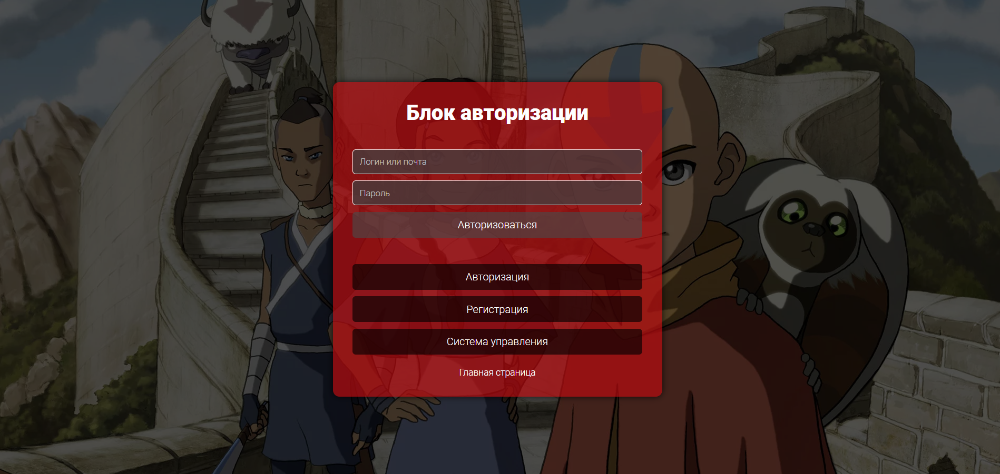

**Главная страница (для пользователя):**

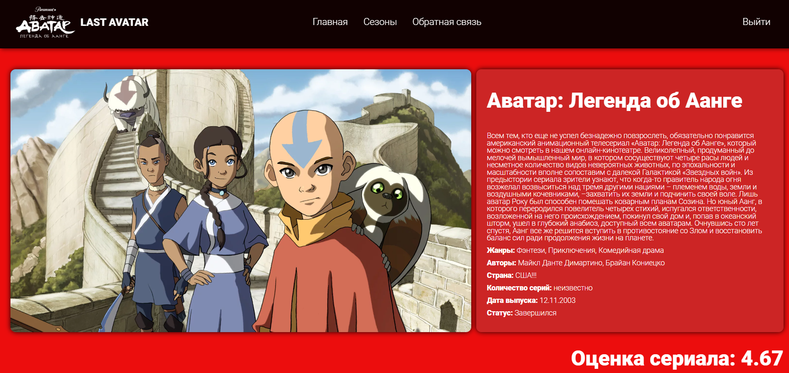

**Сезоны (на главной - часть и на отдельно выделенной странице):**

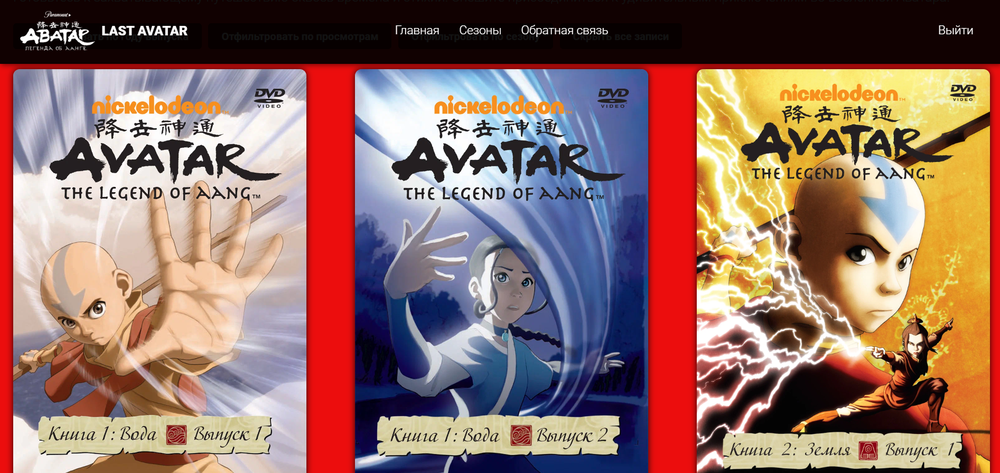
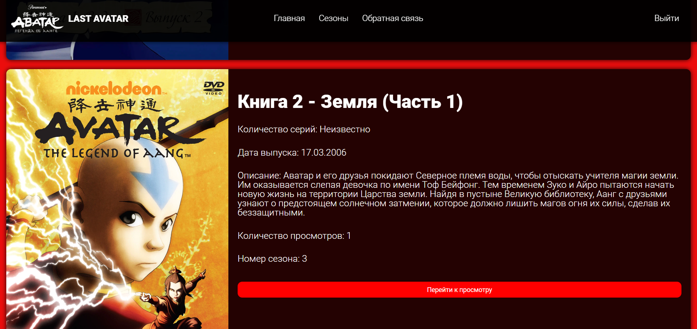

**Серии сезона (подробности о сезоне):**

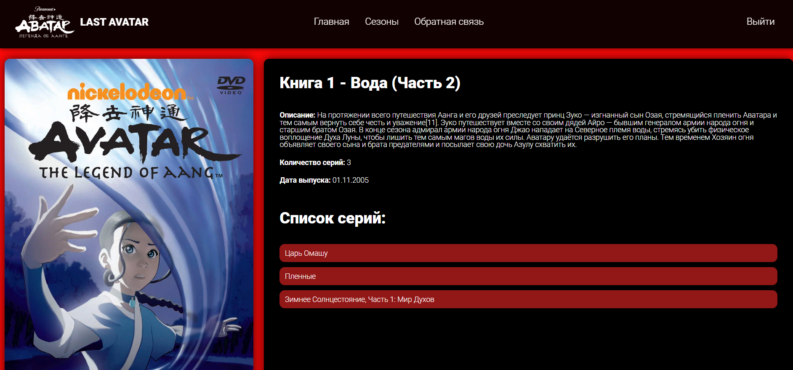

**Выбранная серия сезона:**

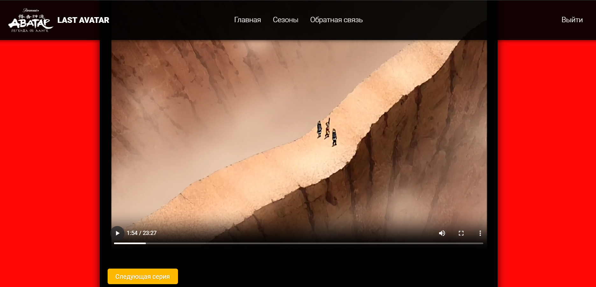

**Комментарии к сериям:**

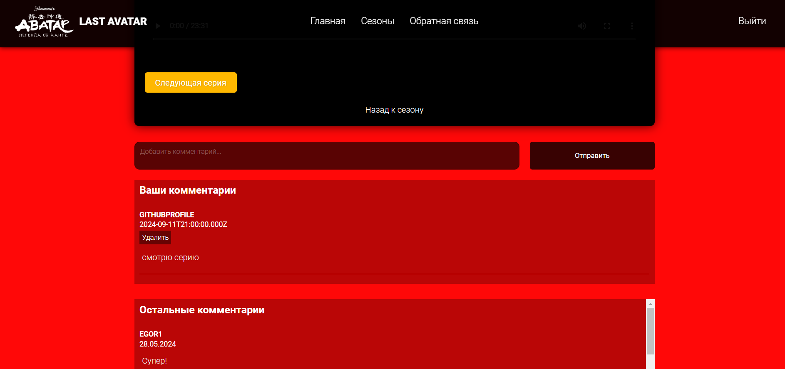

**Админ-панель:**

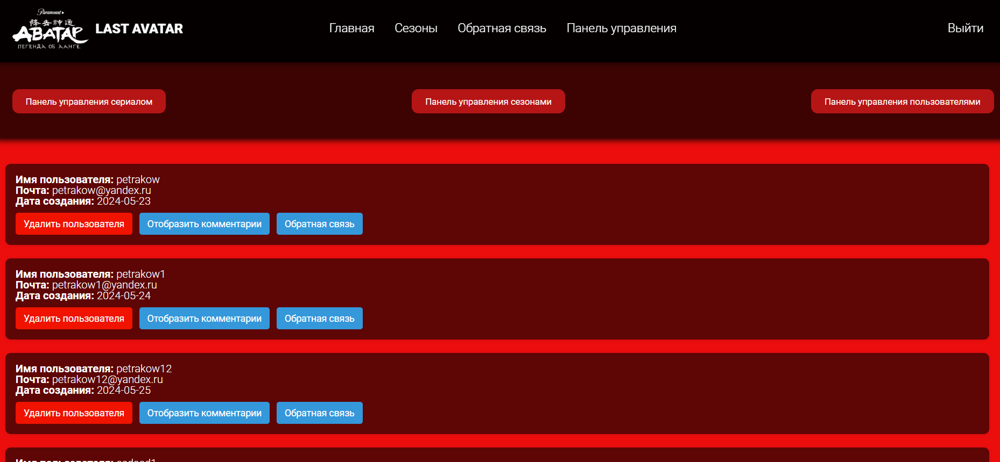
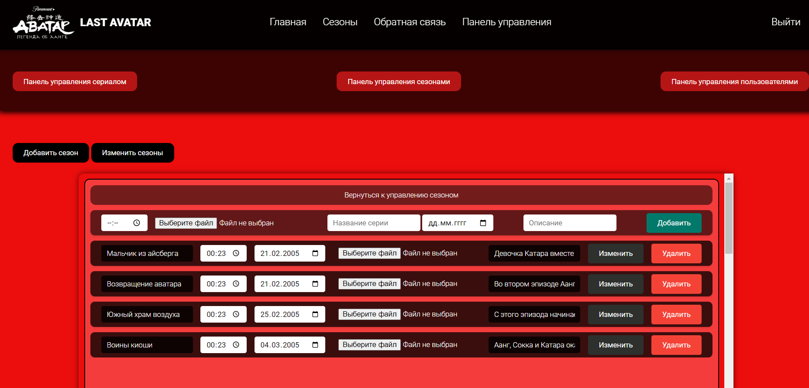
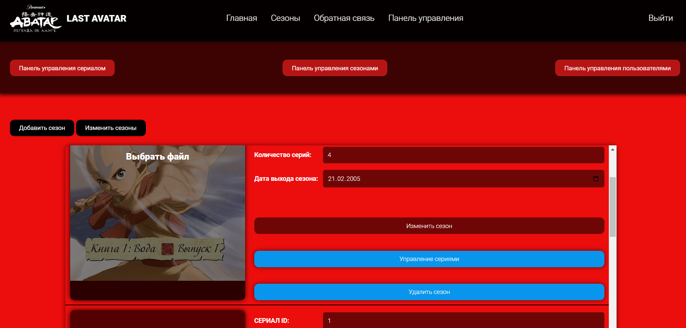
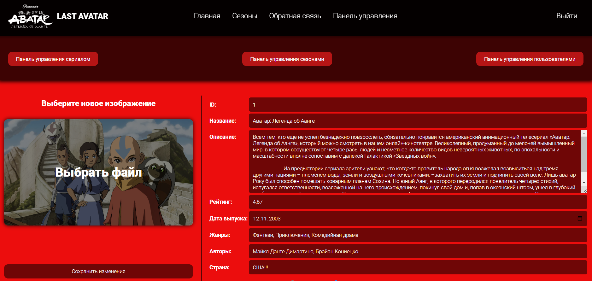
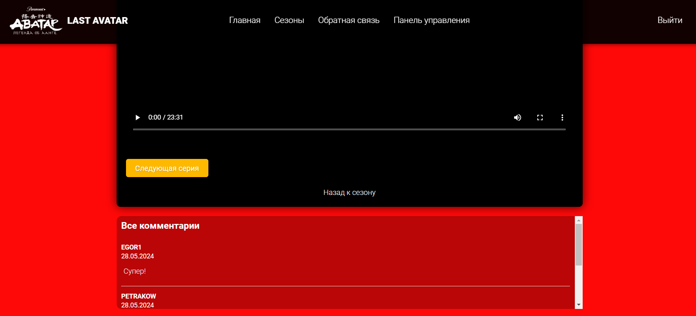

**404 страница:**

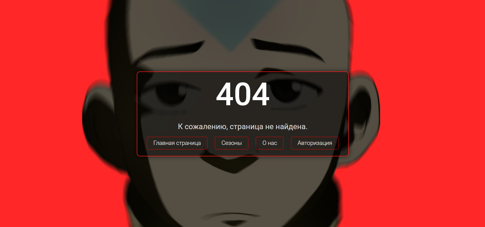